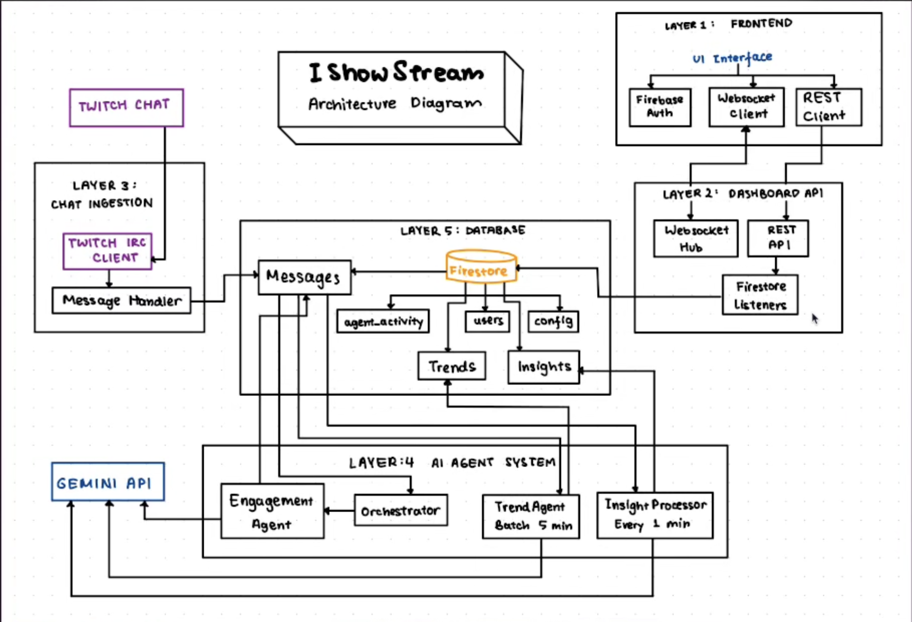

# IShowStream 🎮

**AI-Powered Multi-Agent Twitch Chat Analytics Platform**

Built for the Google Cloud Run Hackathon 2025 - AI Agents Category

IShowStream helps streamers understand their chat in real-time using a 5-agent AI system powered by Gemini AI and deployed on Google Cloud Run.

🌐 **[Live Demo](https://ishowstream-234sus25va-uc.a.run.app/)**

## 🎥 Demo Video

See **IShowStream** in action:

[](https://www.youtube.com/watch?v=CkMfKIbwOQk)

### 🎬 Overview
- Shows how IShowStream connects to live Twitch chat
- Demonstrates real-time message filtering and emotion detection
- Displays how insights are generated by the multi-agent AI system
- Walks through the dashboard with trends, engagement, and chat analytics

---

## 🤖 Multi-Agent System Architecture

IShowStream uses **5 specialized AI agents** that work together to analyze Twitch chat in real-time:

### Agent Pipeline:
```
📨 Message → 🔍 SpamFilter → 🎯 Priority → 💬 Engagement → 📊 Dashboard
             (every message)  (every message) (every message)

📊 Batch    → 📈 TrendAgent → Trends/Memes → 📊 Dashboard
             (every 5 minutes, 50 messages)

⏱️ Periodic → 💡 InsightAgent → AI Insights → 📊 Dashboard
             (every 1 minute, last 60s of messages)
```

### Agent 1: **SpamFilterAgent**
- **Role**: Spam Detection & Content Filtering
- **Model**: Gemini 2.0 Flash
- **Capabilities**: Spam detection, bot detection, pattern matching
- **Output**: Spam classification with confidence scores

### Agent 2: **PriorityAgent**
- **Role**: Message Prioritization & Ranking
- **Model**: Gemini 2.0 Flash
- **Capabilities**: Importance ranking (1-10), category classification
- **Depends on**: SpamFilterAgent (only processes non-spam)
- **Output**: Priority scores for important messages

### Agent 3: **EngagementAgent**
- **Role**: Engagement Potential Prediction
- **Model**: Gemini 2.0 Flash
- **Capabilities**: Predicts conversation potential (1-10), streamer response recommendations
- **Output**: Engagement scores, should_respond flags

### Agent 4: **TrendAgent**
- **Role**: Trend & Pattern Detection
- **Model**: Gemini 2.0 Flash
- **Capabilities**: Trending topics, meme tracking, spam wave detection, chat mood analysis
- **Runs**: Every 5 minutes on last 50 messages (batch analysis)
- **Output**: Top words, emotes, trending topics, overall mood

### Agent 5: **InsightAgent**
- **Role**: High-Level Chat Analysis & Insights
- **Model**: Gemini 2.0 Flash
- **Capabilities**: Emotion clustering, topic summarization, actionable recommendations
- **Runs**: Every 1 minute on last 60 seconds of messages
- **Output**: AI-generated insights with emotion analysis and streamer recommendations

### Multi-Agent Orchestration:
The **AgentOrchestrator** coordinates all agents:
1. **Per-Message Pipeline**: Spam → Priority → Engagement (real-time)
2. **Batch Analysis**: TrendAgent analyzes patterns across messages (every 5 min)
3. **Insight Generation**: InsightAgent generates high-level insights (every 1 min)
4. **WebSocket Updates**: Real-time agent activity broadcast to dashboard

**Multi-Agent Features:**
- ✅ Agent specialization (5 distinct roles)
- ✅ Sequential processing pipeline
- ✅ Batch processing patterns
- ✅ Conditional agent invocation
- ✅ State management across agents
- ✅ Real-time communication between agents and frontend

---

## 🏗️ System Architecture



**Pipeline overview**
- Twitch IRC sends live chat messages to the Chat Ingestion Service
- Messages are saved to Firestore
- The Multi Agent Orchestrator in Python with Gemini AI processes messages and writes insights and trends to Firestore
- The Dashboard API in Go serves REST and WebSocket endpoints
- The React Dashboard subscribes to real time updates and renders insights

---

## 🚀 Quick Start

### Prerequisites:
- Node.js 18+ and npm
- Go 1.24+
- Python 3.12+
- Google Cloud account with Firestore enabled
- Twitch Developer account

### 1. Clone the Repository:
```bash
git clone https://github.com/JosephDavisC/streamsense.git
cd streamsense
```

### 2. Setup Environment Variables:
```bash
cp config/.env.example config/.env
```

Edit `config/.env` with your credentials:
```bash
# Google Cloud
GOOGLE_CLOUD_PROJECT=your-project-id
GOOGLE_API_KEY=your-gemini-api-key

# Twitch
TWITCH_CLIENT_ID=your-client-id
TWITCH_CLIENT_SECRET=your-client-secret
TWITCH_CHANNEL=xqc    # Channel to monitor
```

### 3. Authenticate with Google Cloud:
```bash
gcloud auth application-default login
```

### 4. Install Dependencies:
```bash
# Backend agents (Python)
cd backend/agents
python3 -m venv venv
source venv/bin/activate
pip install -r requirements.txt
cd ../..

# Frontend
cd frontend/dashboard
npm install
cd ../..
```

### 5. Start All Services:
```bash
./start-all.sh
```

Then open: **http://localhost:3000**

### 6. Stop All Services:
```bash
./stop-all.sh
```

---

## 📁 Project Structure

```
streamsense/
├── backend/
│   ├── chat-ingestion/     # Go - Twitch IRC ingestion service
│   │   └── main.go
│   ├── dashboard-api/      # Go - REST API + WebSocket
│   │   └── main.go
│   └── agents/             # Python - Multi-Agent System
│       ├── orchestrator.py        # Agent coordinator
│       ├── spam_filter_agent.py   # Agent 1: Spam detection
│       ├── priority_agent.py      # Agent 2: Priority ranking
│       ├── engagement_agent.py    # Agent 3: Engagement prediction
│       ├── trend_agent.py         # Agent 4: Trend detection
│       ├── insight_agent.py       # Agent 5: Insight generation
│       └── requirements.txt
├── frontend/
│   └── dashboard/          # React - Real-time dashboard UI
│       ├── src/
│       │   ├── App.js
│       │   └── components/
│       │       ├── Dashboard.js
│       │       ├── Landing.js
│       │       ├── Blog.js
│       │       ├── History.js
│       │       └── Profile.js
│       └── package.json
├── config/
│   └── .env                # Environment variables
├── start-all.sh            # Start all services
└── stop-all.sh             # Stop all services
```

---

## 🛠️ Tech Stack

### Backend:
- **Go (Golang)** - High-performance service layer (Chat Ingestion, Dashboard API)
- **Python** - AI agents with Gemini
- **Firestore** - Real-time NoSQL database
- **Twitch IRC** - Live chat streaming

### AI/ML:
- **Google Gemini 2.0 Flash** - LLM for all agent analysis
- **Multi-Agent Architecture** - 5 specialized agents working in parallel

### Frontend:
- **React 19** - Modern UI framework
- **WebSocket** - Real-time updates
- **Firebase Auth** - User authentication

### DevOps:
- **Google Cloud Run** - Serverless container platform
- **Docker** - Containerization
- **Git** - Version control

---

## ☁️ Cloud Run Deployment

Deploy all services to Google Cloud Run:

```bash
# Set your project ID
export PROJECT_ID=your-project-id

# Deploy Chat Ingestion
cd backend/chat-ingestion
gcloud run deploy chat-ingestion \
  --source . \
  --region us-central1 \
  --allow-unauthenticated \
  --project=$PROJECT_ID

# Deploy Dashboard API
cd ../dashboard-api
gcloud run deploy dashboard-api \
  --source . \
  --region us-central1 \
  --allow-unauthenticated \
  --project=$PROJECT_ID

# Deploy AI Agents
cd ../agents
gcloud run deploy agents \
  --source . \
  --region us-central1 \
  --set-env-vars GOOGLE_API_KEY=your-key \
  --project=$PROJECT_ID

# Deploy Frontend
cd ../../frontend/dashboard
gcloud run deploy ishowstream \
  --source . \
  --region us-central1 \
  --allow-unauthenticated \
  --set-env-vars="REACT_APP_API_URL=https://dashboard-api-xxx.run.app,REACT_APP_WS_URL=wss://dashboard-api-xxx.run.app/ws" \
  --project=$PROJECT_ID
```

---

## 🎨 Features

### For Streamers:
- ✅ **Real-time chat monitoring** - See all messages as they happen
- ✅ **Automatic spam filtering** - AI removes spam/scams/bots
- ✅ **Priority highlighting** - Important messages stand out
- ✅ **AI-generated insights** - Understand chat emotion and topics every minute
- ✅ **Trend detection** - See what's trending in your chat
- ✅ **Pause/Resume monitoring** - Save API credits when not streaming
- ✅ **Dynamic channel switching** - Change Twitch channel without restart

### UI Features:
- ✅ **Real-time dashboard** - Live stats and metrics
- ✅ **History view** - Review past insights
- ✅ **Dark/Light mode** - Customizable theme
- ✅ **WebSocket updates** - Instant agent activity notifications
- ✅ **Responsive design** - Works on desktop and mobile

---

## 🏆 Built For

**Google Cloud Run Hackathon 2025**
- **Category**: AI Agents
- **Technologies**: Cloud Run, Gemini AI, Firestore, Go, Python, React
- **Team**: JJA ([Joseph Davis Chamdani](https://github.com/JosephDavisC), [Abraham Guan](https://github.com/AbrahamWG), [Juwita Jessica Pangestu](https://github.com/JuwitaJessicaP))

---

## 📝 License

MIT License - See LICENSE file for details

---

**Made with ❤️ using Google Cloud Run and Gemini AI**

